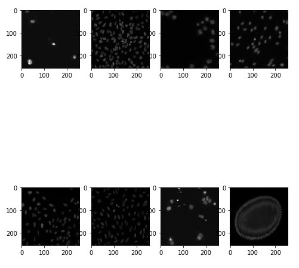
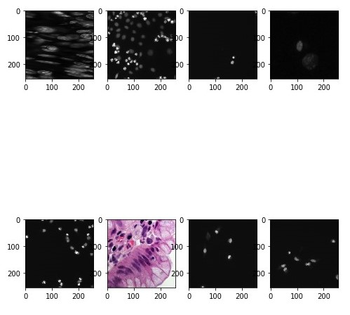
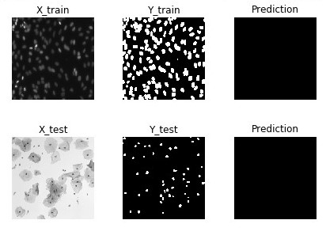
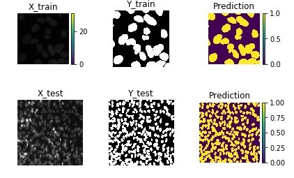
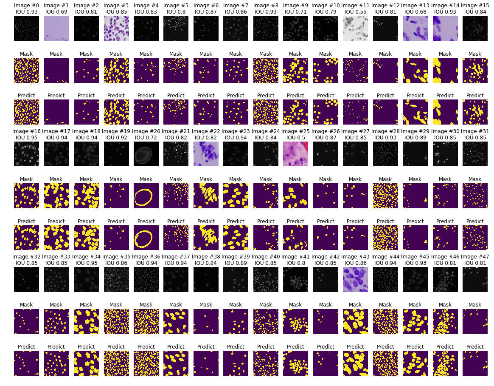
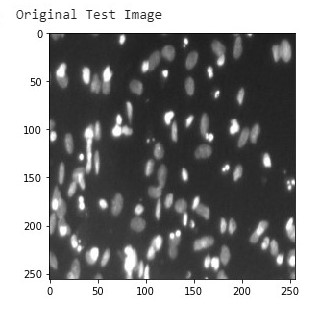
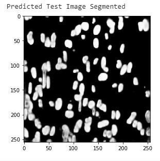

# Approach & supported study for <u>Nuclei Segmentation using Mask-RCNN</u>

### Introduction

**Image segmentation** is the process of partitioning a digital image into multiple segments (sets of pixels, also known as super-pixels). The goal of segmentation is to simplify and/or change the representation of an image into something that is more meaningful and easier to analyze. Image segmentation is typically used to locate objects and boundaries (lines, curves, etc ) in images. More precisely, image segmentation is the process of assigning a label to every pixel in an image such that pixels with the same label share certain characteristics.

The typical use of convolutional networks is on classification tasks, where the output to an image is a single class label. However, in many visual tasks, especially in biomedical image processing, the desired output should include localization, i.e., a class label is supposed to be assigned to each pixel.

### About dataset

We are given [Nuclei Segmentation dataset](https://drive.google.com/open?id=1BdIovcY9NzwXhP146u98xcXRp_ZqO-zv) which consists of training and test zip files for training images and test images respectively. Inside training images, we have 2 folders for different types of nuclei classes. One folder is for the original training image, and second is the masks images of the training image. Inside test folder, we simply have the image and our target is to mask or segment all the nuclei using Average mean prediction matrices. 

Sample training images:

Sample training images:

### Approach

Such biomedical images require very precise training since nuclei size in an image might even vary from 100x100 pixel to 1x1 pixel. Detection and segmenting such low resolution nuclei is very important and also difficult. One very famous architecture used of segmenting nuclei is [U-Net: Convolutional Networks for Biomedical Image Segmentation](https://arxiv.org/pdf/1505.04597.pdf) presented by Olaf Ronneberger, Philipp Fischer, and Thomas Brox.

The architecture looks something like this

It consists of a contracting path (left side) and an expansive path (right side). The contracting path follows the typical architecture of a convolutional network. It consists of the repeated application of two 3x3 convolutions (unpadded convolutions), each followed by a rectified linear unit (ReLU) and a 2x2 max pooling operation with stride 2 for downsampling. At each downsampling step we double the number of feature channels. Every step in the expansive path consists of an upsampling of the feature map followed by a 2x2 convolution (“up-convolution”) that halves the number of feature channels, a concatenation with the correspondingly cropped feature map from the contracting path, and two 3x3 convolutions, each followed by a ReLU. The cropping is necessary due to the loss of border pixels in every convolution. At the final layer a 1x1 convolution is used to map each 64 component feature vector to the desired number of classes. In total the network has 23 convolutional layers. [Reference paper](https://arxiv.org/pdf/1505.04597.pdf)

The initial approach was made using the default architecture, which had 31,032,837 trainable parameters. 

When trained for 15 epochs, the network resulted in constant IOU. Hence, we were not able to apply the UNet default architecture directly for our problem statement. During prediction, we keep a threshold value of prediction, over which all the images are segmented based on their mean IOU. The threshold value is 0.5. When predictions were made from the default architecture, it resulted in a dark image without any segmentation since mean IOU was not greater than 0.5, can also seen in the following prediction image.

 

#### Inferences made from default U-Net and definition of updated architecture

- Inference 1: Relu was eliminating all the True Negatives completely and our network was no longer able to learn further. Hence we our network never improved after a certain point. 
- Inference 2: Mean_IOU is not increasing by using default U-Net architecture, but surely we see that validation loss has constantly decreased. We needed to tweak the architecture.
- Inference 3: All the input images are pretty flat and un-normalized. This could be one of the reasons as well since the mask over the images are normalized, the values of gradients is not able to identify most loudly screaming features after masking.

#### Transition to updated Architecture

- We added the drop-outs after every convolution layer since the accuracy gaps in the default architecture was huge. So to avoid overfitting and large accuracy gaps, we adding small dropouts with 0.1 as rate.
- All the images during input are scaled by dividing each input image by 255. This helps in normalizing all the pixel to a normally distributed value range.
- Instead of using Relu, we use elu so as to provide exponentially smaller value but not 0. 
- Reduced the number of parameters since total number of parameters in default architecture are very high. By following this approach, we reduced the number of parameters to 1,941,105.

New architecture is

Using the above architecture, we obtained Mean_IOU score of 86%, which is double to that of default architecture. 

This network did fantastic job during predictions, which can also be concluded by the following image.

#### Image Augmentation (Worth a try)

We also tried to Image augmentations strategies mentioned in the [U-Net Paper](https://arxiv.org/pdf/1505.04597.pdf). We used normal rotation, width & height shifting, shear deformations, flips and zoom ranges. However, they did not work out on the trained model and decreased mean_IOU score. So we did not move ahead. Do not consider this approach during evaluation. 

# Final Predictions on Validation set

# Prediction on Test Images and & sample prediction output

# Thank you!

### - Praveen Kumar

